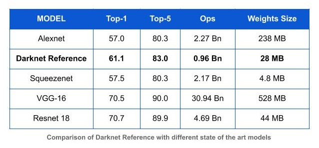

# About
We designed a Neural Network Accelerator for [Darknet Reference Model](https://pjreddie.com/darknet/imagenet/#reference) (which  is 2.9 times faster than AlexNet and attains the same top-1 and top-5 performance as AlexNet but with 1/10th the parameters). 

 

# Table of Contents

   * [About](#about)
   * [Table of Contents](#table-of-contents)
      * [Board](#board)
      * [Requirements](#requirements)
      * [Files](#files)
      * [CNN Architecture](#cnn-architecture)
      * [Results](#results)
      * [Planned Improvements](#planned-improvements)


## Board
- [Terasic DE10-Nano Development Kit (Cyclone V SoC FPGA)](https://software.intel.com/content/www/us/en/develop/articles/terasic-de10-nano-get-started-guide.html)

## Requirements
- [Intel® FPGA SDK for OpenCL™ 18.1](https://fpgasoftware.intel.com/opencl/18.1/?edition=standard)
- [Intel® SoC FPGA Embedded Development Suite 18.1 (SoC EDS)](https://fpgasoftware.intel.com/soceds/18.1/?edition=standard)
- [PuTTY](https://www.putty.org/)
- PyTorch
- PyOpenCL 

## Files 
- [pytorch_model ](pytorch_model/pytorch_model.ipynb)- The Neural network we used is based on Darknet Framework. So, we had to implemented the model in PyTorch Framework to check the results.
- [pyopencl_model ](pyopencl_model/pyopencl.ipynb) - 
To simulate and verify the kernels we wrote in OpenCL, we used PyOpenCL package and it worked with same accuracy as PyTorch model and acheived about 20x speed than PyTorch model.
- [model ](model) - This folder contains the pre-trained model parameters of darknet reference model of each layer in seperate txt file.

## CNN Architecture  

<center>

|    | Layer    | Filters | Kernel Size | Stride | Pad |   Input Size  |  Output Size   |   
|---:|---------:|--------:|------------:|-------:|----:|-------------:|--------------:| 
| 1  |conv      | 16      | 3 x 3       | 1      | 1   |256 x 256 x 3  | 256 x 256 x 16 | 
| 2  |max       |         | 2 x 2       | 2      | 0   |256 x 256 x 16 | 128 x 128 x 16 | 
| 3  |conv      | 32      | 3 x 3       | 1      | 1   |128 x 128 x 16 | 128 x 128 x 32 |
| 4  |max       |         | 2 x 2       | 2      | 0   |128 x 128 x 32 | 64 x 64 x 32   |
| 5  |conv      | 64      | 3 x 3       | 1      | 1   |64 x 64 x 32   | 64 x 64 x 64   | 
| 6  |max       |         | 2 x 2       | 2      | 0   |64 x 64 x 64   | 32 x 32 x 64   | 
| 7  |conv      | 128     | 3 x 3       | 1      | 1   |32 x 32 x 64   | 32 x 32 x 128  | 
| 8  |max       |         | 2 x 2       | 2      | 0   |32 x 32 x 128  | 16 x 16 x 128  | 
| 9  |conv      | 256     | 3 x 3       | 1      | 1   |16 x 16 x 128  | 16 x 16 x 256  | 
| 10 |max       |         | 2 x 2       | 2      | 0   |16 x 16 x 256  | 8 x 8 x 256    |
| 11 |conv      | 512     | 3 x 3       | 1      | 1   |8 x 8 x 256    | 8 x 8 x 512    |
| 12 |max       |         | 2 x 2       | 2      | 0   |8 x 8 x 512    | 4 x 4 x 512    | 
| 13 |conv      | 1024    | 3 x 3       | 1      | 1   |4 x 4 x 512    | 4 x 4 x 1024   | 
| 14 |avg       |         | 4 x 4       | 1      | 0   |4 x 4 x 1024   | 1 x 1 x 1024   | 
| 15 |conv      | 1000    | 1 x 1       | 1      | 0   |1 x 1 x 1024   | 1 x 1 x 1000   | 

</center>


## Results
```
Conv 0  time: 35.898 ms                                                         
Conv 2  time: 79.748 ms                                                         
Conv 4  time: 79.439 ms                                                         
Conv 6  time: 79.442 ms                                                         
Conv 8  time: 79.418 ms                                                         
Conv 10 time: 79.411 ms                                                         
Conv 12 time: 79.404 ms                                                         
Conv 14 time: 17.319 ms                                                         
Total Convolution time: 530.079 ms

Batchnorm 0   time: 143.092 ms                                                  
Batchnorm 2   time: 73.007 ms                                                   
Batchnorm 4   time: 21.486 ms                                                   
Batchnorm 6   time: 5.504 ms                                                    
Batchnorm 8   time: 2.479 ms                                                    
Batchnorm 10  time: 1.259 ms                                                    
Batchnorm 12  time: 0.641 ms                                                    
Batchnorm 14  time: 0.052 ms                                                    
Total Batchnorm time: 247.520 ms   

Maxpool 1  time: 78.848 ms                                                      
Maxpool 3  time: 31.823 ms                                                      
Maxpool 5  time: 8.991 ms                                                       
Maxpool 7  time: 2.890 ms                                                       
Maxpool 9  time: 1.486 ms                                                       
Maxpool 11  time: 0.719 ms                                                      
Maxpool 13  time: 0.286 ms                                                      
Total Pooling time: 125.042 ms                                                  
                                                                                
Total Time: 902.642                                                             
                                                                                
Label   : Egyptian cat                                                          
Accuracy: 35.796 % 

```

## Planned Improvements

We can further improve the throughput of the accelerator by converting the model to fixed point (8-bit or 16-bit) and pipelining the accelerator by using Intel channels and pipes
extension.